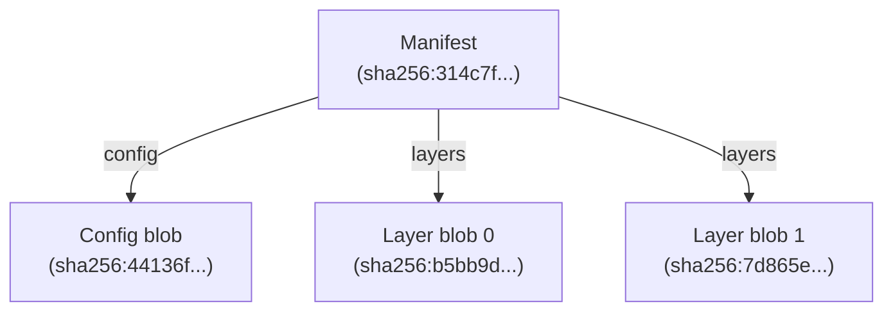
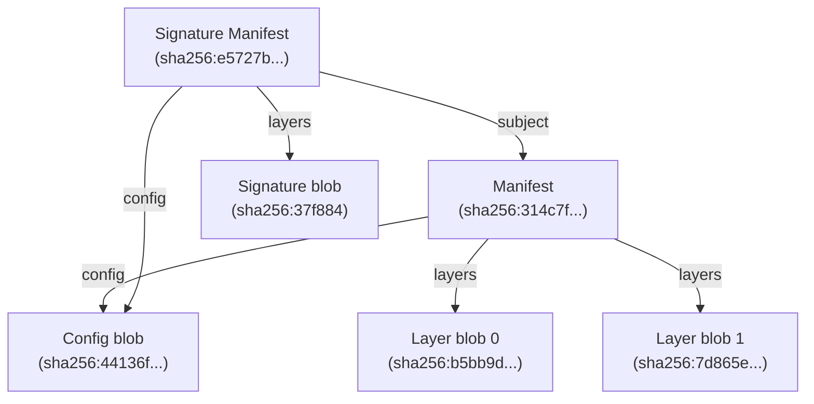

# Modeling Artifacts

In ORAS Go v2, artifacts are modeled as [Directed Acyclic Graphs (DAGs)](https://en.wikipedia.org/wiki/Directed_acyclic_graph) stored in [Content-Addressable Storages (CASs)](https://en.wikipedia.org/wiki/Content-addressable_storage).

An artifact is a rooted DAG where the root node is an [OCI Manifest](https://github.com/opencontainers/image-spec/blob/v1.1.0/manifest.md). Additionally, artifacts can be grouped by an [OCI Index](https://github.com/opencontainers/image-spec/blob/v1.1.0/image-index.md), which is also a rooted DAG.

## Simple Graph

Here is an example of a manifest of artifact:

```json
{
  "schemaVersion": 2,
  "mediaType": "application/vnd.oci.image.manifest.v1+json",
  "artifactType": "application/vnd.example+type",
  "config": {
    "mediaType": "application/vnd.oci.empty.v1+json",
    "digest": "sha256:44136fa355b3678a1146ad16f7e8649e94fb4fc21fe77e8310c060f61caaff8a",
    "size": 2,
    "data": "e30="
  },
  "layers": [
    {
      "mediaType": "application/vnd.custom.type",
      "digest": "sha256:b5bb9d8014a0f9b1d61e21e796d78dccdf1352f23cd32812f4850b878ae4944c",
      "size": 4,
      "annotations": {
        "org.opencontainers.image.title": "foo.txt"
      }
    },
    {
      "mediaType": "application/vnd.custom.type",
      "digest": "sha256:7d865e959b2466918c9863afca942d0fb89d7c9ac0c99bafc3749504ded97730",
      "size": 4,
      "annotations": {
        "org.opencontainers.image.title": "bar.txt"
      }
    }
  ],
  "annotations": {
    "org.opencontainers.image.created": "2025-01-23T10:57:27Z"
  }
}
```

The manifest indicates that the artifact contains a config blob and two layer blobs. When stored in a CAS, a digest will be computed from the manifest content. For this particular manifest, the digest is `sha256:314c7f20dd44ee1cca06af399a67f7c463a9f586830d630802d9e365933da9fb`. 

The artifact stored in CAS can be represented by the graph below:



This graph is of a [Merkle](https://en.wikipedia.org/wiki/Merkle_tree) Directed Acyclic Graph (DAG) structure, where every object is a node uniquely identified by its digest. Since the digests are computed from the content and the content is fixed, every node itself in the graph is immutable.
In this graph, The manifest is the root of the graph and the config or layer blobs are the leaf nodes referenced by the root.

## Complex Graph

If the artifact manifest is signed by signing tools like `notation`, a signature manifest referencing the signature blob will be created and attached to the artifact manifest. The signature manifest looks like:

```json
{
  "schemaVersion": 2,
  "mediaType": "application/vnd.oci.image.manifest.v1+json",
  "config": {
    "mediaType": "application/vnd.cncf.notary.signature",
    "digest": "sha256:44136fa355b3678a1146ad16f7e8649e94fb4fc21fe77e8310c060f61caaff8a",
    "size": 2
  },
  "layers": [
    {
      "mediaType": "application/jose+json",
      "digest": "sha256:37f88486592fd90ace303ee38f8d1ff698193e76c76d3c1fef8627a39e677696",
      "size": 2090
    }
  ],
  "subject": {
    "mediaType": "application/vnd.oci.image.manifest.v1+json",
    "digest": "sha256:314c7f20dd44ee1cca06af399a67f7c463a9f586830d630802d9e365933da9fb",
    "size": 762
  },
  "annotations": {
    "io.cncf.notary.x509chain.thumbprint#S256": "[\"a9c85558943f197f41fe7cf3caf691f7df8d0088be426a33d895560717893962\"]",
    "org.opencontainers.image.created": "2025-02-01T09:50:52Z"
  }
}
```

The signature manifest indicates that the signature artifact contains one config blob and one layer blob, and its subject manfiest is `sha256:314c7f20dd44ee1cca06af399a67f7c463a9f586830d630802d9e365933da9fb`, which is the digest of the artifact manifest in the above example. When stored in a CAS, a digest will be computed from the signature manifest content. For this particular signature manifest, the digest is `sha256:e5727bebbcbbd9996446c34622ca96af67a54219edd58d261112f1af06e2537c`.

The relationship of the artifact and the signature in the CAS can be modeled as the graph below:



Now, the signature manifest is the root of the whole graph containing both the signature blobs and artifact blobs, while the artifact manifest is the root of the sub-graph containing the artifact blobs.

Note that since the content of the config blob of the artifacf and the signature are the same, their digest are identical. As a result, there will be only config blob stored in the CAS, identified by its digest. In the graph, the signature manifest and the artifact manifest points to the same node of config blob.
This is a common case and it's why artifacts are modeled as graphs instead of trees.


// TODO: similarly, Image index...

// TODO: simplify the graph using alias

// TODO: The relationship between Predecessors and Referrers.

// TODO: The difference between Copy and ExtendedCopy.