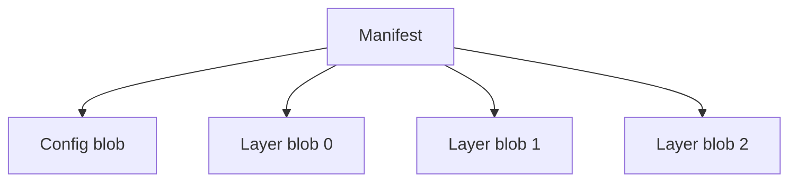

# Modeling Artifacts

In ORAS Go v2, artifacts are modeled as [Directed Acyclic Graphs (DAGs)](https://en.wikipedia.org/wiki/Directed_acyclic_graph) stored in [Content-Addressable Storages (CASs)](https://en.wikipedia.org/wiki/Content-addressable_storage).

An artifact is a rooted DAG where the root node is an [OCI Manifest](https://github.com/opencontainers/image-spec/blob/v1.1.0/manifest.md). Additionally, artifacts can be grouped by an [OCI Index](https://github.com/opencontainers/image-spec/blob/v1.1.0/image-index.md), which is also a rooted DAG.

Here is an example of a container image manifest:

```json
{
  "schemaVersion": 2,
  "mediaType": "application/vnd.oci.image.manifest.v1+json",
  "config": {
    "mediaType": "application/vnd.oci.image.config.v1+json",
    "digest": "sha256:b5b2b2c507a0944348e0303114d8d93aaaa081732b86451d9bce1f432a537bc7",
    "size": 7023
  },
  "layers": [
    {
      "mediaType": "application/vnd.oci.image.layer.v1.tar+gzip",
      "digest": "sha256:9834876dcfb05cb167a5c24953eba58c4ac89b1adf57f28f2f9d09af107ee8f0",
      "size": 32654
    },
    {
      "mediaType": "application/vnd.oci.image.layer.v1.tar+gzip",
      "digest": "sha256:3c3a4604a545cdc127456d94e421cd355bca5b528f4a9c1905b15da2eb4a4c6b",
      "size": 16724
    },
    {
      "mediaType": "application/vnd.oci.image.layer.v1.tar+gzip",
      "digest": "sha256:ec4b8955958665577945c89419d1af06b5f7636b4ac3da7f12184802ad867736",
      "size": 73109
    }
  ]
}
```

The manifest indicates that the container image contains a config blob and three layer blobs.
// TODO: explain the descriptor, digest, and size

The container image can be represented by the graph below:



Where the manifest is the root of the graph and the config or layer blobs are the leaf nodes referenced by the root.

// TODO: explain artifacts
// TODO: artifacts vs. container images
// TODO: artifacts with referrers