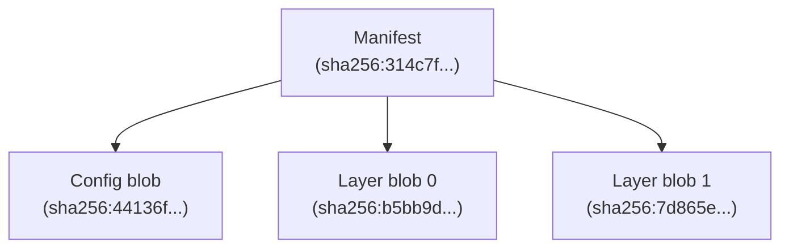

# Modeling Artifacts

In ORAS Go v2, artifacts are modeled as [Directed Acyclic Graphs (DAGs)](https://en.wikipedia.org/wiki/Directed_acyclic_graph) stored in [Content-Addressable Storages (CASs)](https://en.wikipedia.org/wiki/Content-addressable_storage).

An artifact is a rooted DAG where the root node is an [OCI Manifest](https://github.com/opencontainers/image-spec/blob/v1.1.0/manifest.md). Additionally, artifacts can be grouped by an [OCI Index](https://github.com/opencontainers/image-spec/blob/v1.1.0/image-index.md), which is also a rooted DAG.


Here is an example of a manifest of artifact:

```json
{
  "schemaVersion": 2,
  "mediaType": "application/vnd.oci.image.manifest.v1+json",
  "artifactType": "application/vnd.example+type",
  "config": {
    "mediaType": "application/vnd.oci.empty.v1+json",
    "digest": "sha256:44136fa355b3678a1146ad16f7e8649e94fb4fc21fe77e8310c060f61caaff8a",
    "size": 2,
    "data": "e30="
  },
  "layers": [
    {
      "mediaType": "application/vnd.custom.type",
      "digest": "sha256:b5bb9d8014a0f9b1d61e21e796d78dccdf1352f23cd32812f4850b878ae4944c",
      "size": 4,
      "annotations": {
        "org.opencontainers.image.title": "foo.txt"
      }
    },
    {
      "mediaType": "application/vnd.custom.type",
      "digest": "sha256:7d865e959b2466918c9863afca942d0fb89d7c9ac0c99bafc3749504ded97730",
      "size": 4,
      "annotations": {
        "org.opencontainers.image.title": "bar.txt"
      }
    }
  ],
  "annotations": {
    "org.opencontainers.image.created": "2025-01-23T10:57:27Z"
  }
}
```

The manifest indicates that the artifact contains a config blob and two layer blobs. When stored in a CAS, a digest will be computed for identifying the manifest. For this particular manifest, the digest is `sha256:314c7f20dd44ee1cca06af399a67f7c463a9f586830d630802d9e365933da9fb`. 

The artifact can be represented by the graph below:



Where the manifest is the root of the graph and the config or layer blobs are the leaf nodes referenced by the root.

// TODO: explain artifacts
// TODO: artifacts vs. container images
// TODO: artifacts with referrers