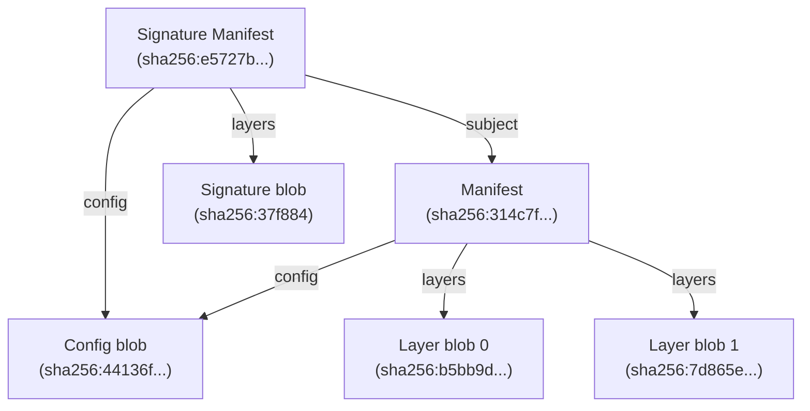
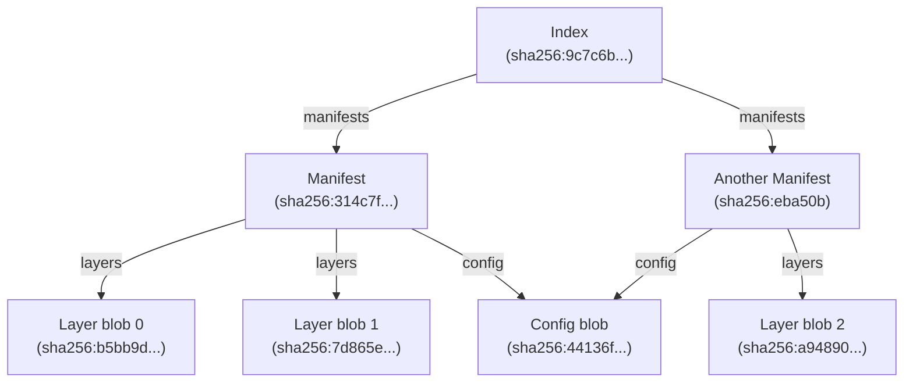
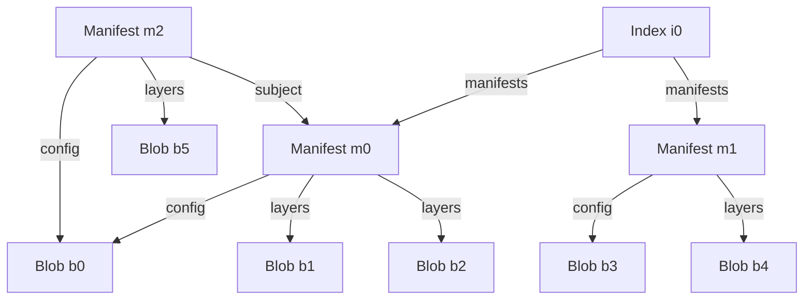
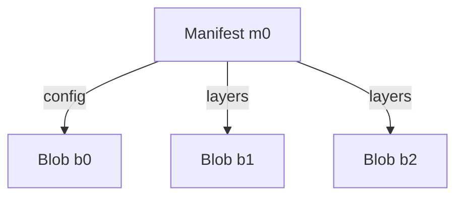
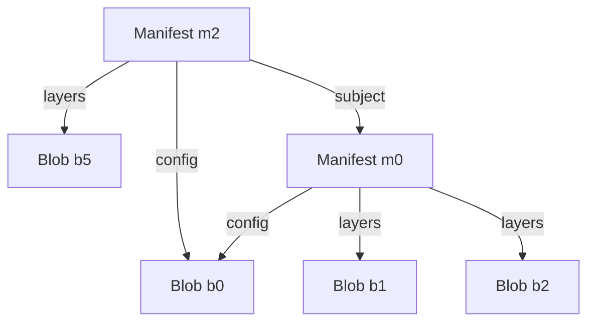
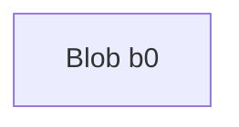
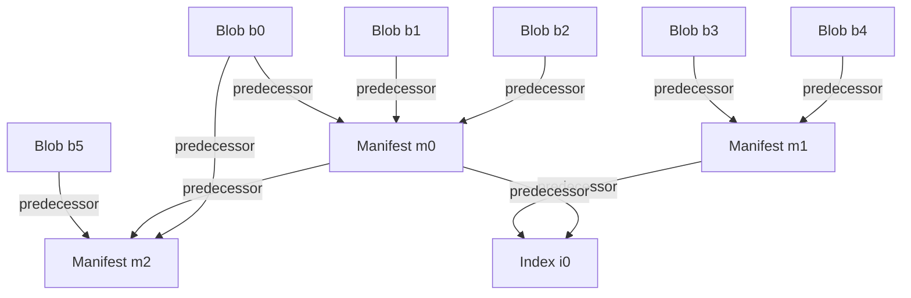
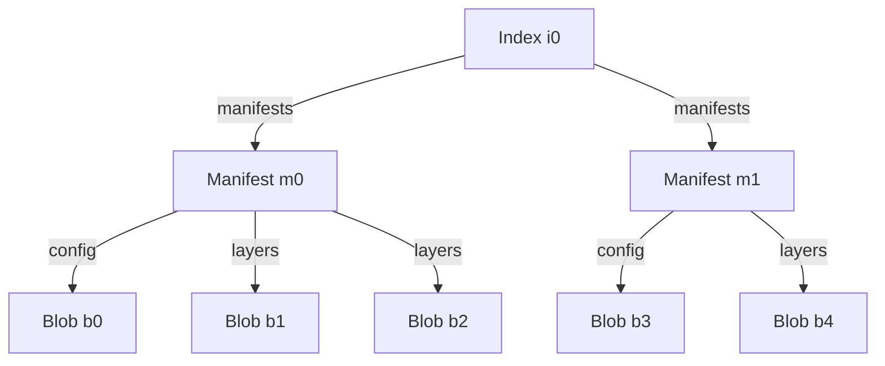
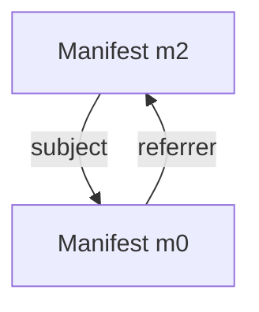

# Modeling Artifacts

In ORAS Go v2, artifacts are modeled as [Directed Acyclic Graphs (DAGs)](https://en.wikipedia.org/wiki/Directed_acyclic_graph) stored in [Content-Addressable Storages (CASs)](https://en.wikipedia.org/wiki/Content-addressable_storage).

An artifact is a rooted DAG where the root node is an [OCI Manifest](https://github.com/opencontainers/image-spec/blob/v1.1.0/manifest.md). Additionally, artifacts can be grouped by an [OCI Index](https://github.com/opencontainers/image-spec/blob/v1.1.0/image-index.md), which is also a rooted DAG.

## Simple Artifact

Here is an example of a manifest of artifact:

```json
{
  "schemaVersion": 2,
  "mediaType": "application/vnd.oci.image.manifest.v1+json",
  "artifactType": "application/vnd.example+type",
  "config": {
    "mediaType": "application/vnd.oci.empty.v1+json",
    "digest": "sha256:44136fa355b3678a1146ad16f7e8649e94fb4fc21fe77e8310c060f61caaff8a",
    "size": 2,
    "data": "e30="
  },
  "layers": [
    {
      "mediaType": "application/vnd.custom.type",
      "digest": "sha256:b5bb9d8014a0f9b1d61e21e796d78dccdf1352f23cd32812f4850b878ae4944c",
      "size": 4,
      "annotations": {
        "org.opencontainers.image.title": "foo.txt"
      }
    },
    {
      "mediaType": "application/vnd.custom.type",
      "digest": "sha256:7d865e959b2466918c9863afca942d0fb89d7c9ac0c99bafc3749504ded97730",
      "size": 4,
      "annotations": {
        "org.opencontainers.image.title": "bar.txt"
      }
    }
  ],
  "annotations": {
    "org.opencontainers.image.created": "2025-01-23T10:57:27Z"
  }
}
```

The manifest indicates that the artifact contains a config blob and two layer blobs. When stored in a CAS, a digest will be computed from the manifest content. For this particular manifest, the digest is `sha256:314c7f20dd44ee1cca06af399a67f7c463a9f586830d630802d9e365933da9fb`.

The artifact stored in CAS can be represented by the graph below:


This graph is of a [Merkle](https://en.wikipedia.org/wiki/Merkle_tree) Directed Acyclic Graph (DAG) structure, where every object is a node uniquely identified by its digest. Since the digests are computed from the content and the content is fixed, every node itself in the graph is immutable.
In this graph, The manifest is the root of the graph and the config or layer blobs are the leaf nodes referenced by the root.

## Artifact with Subject

If the artifact manifest is signed by signing tools like `notation`, a signature manifest referencing the signature blob will be created and attached to the artifact manifest. The signature manifest would be similar to this:

```json
{
  "schemaVersion": 2,
  "mediaType": "application/vnd.oci.image.manifest.v1+json",
  "config": {
    "mediaType": "application/vnd.cncf.notary.signature",
    "digest": "sha256:44136fa355b3678a1146ad16f7e8649e94fb4fc21fe77e8310c060f61caaff8a",
    "size": 2
  },
  "layers": [
    {
      "mediaType": "application/jose+json",
      "digest": "sha256:37f88486592fd90ace303ee38f8d1ff698193e76c76d3c1fef8627a39e677696",
      "size": 2090
    }
  ],
  "subject": {
    "mediaType": "application/vnd.oci.image.manifest.v1+json",
    "digest": "sha256:314c7f20dd44ee1cca06af399a67f7c463a9f586830d630802d9e365933da9fb",
    "size": 762
  },
  "annotations": {
    "io.cncf.notary.x509chain.thumbprint#S256": "[\"a9c85558943f197f41fe7cf3caf691f7df8d0088be426a33d895560717893962\"]",
    "org.opencontainers.image.created": "2025-02-01T09:50:52Z"
  }
}
```

The signature manifest indicates that the signature artifact contains one config blob and one layer blob, and its `subject` refers to `sha256:314c7f20dd44ee1cca06af399a67f7c463a9f586830d630802d9e365933da9fb`, which is the digest of the artifact manifest in the above example. This siganature manifest is considered a `Referrer` of the artifact manifest.

When stored in a CAS, a digest will be computed from the signature manifest content. For this particular signature manifest, the digest is `sha256:e5727bebbcbbd9996446c34622ca96af67a54219edd58d261112f1af06e2537c`.

The relationship of the artifact and the signature in the CAS can be modeled as the graph below:



Now, the signature manifest is the root of the whole graph containing both the signature blobs and artifact blobs, while the artifact manifest is the root of the sub-graph containing the artifact blobs.

Note that since the content of the config blob of the artifacf and the signature are the same, their digest are identical. As a result, there will be only config blob stored in the CAS, identified by its digest. In the graph, the signature manifest and the artifact manifest points to the same node of config blob.
This is a common case and it's why artifacts are modeled as graphs instead of trees.

## Index of Artifacts

A Index can also be created for collecting multiple manifests.
For example, an Index manifest referencing the artifact manifest `sha256:314c7f20dd44ee1cca06af399a67f7c463a9f586830d630802d9e365933da9fb` and another random manifest `"sha256:eba50b7b7dfdf6294a375a3376b2b74e3b926c75119f7da04b1c671c7de662c9"` would look like:

```json
{
  "schemaVersion": 2,
  "mediaType": "application/vnd.oci.image.index.v1+json",
  "manifests": [
    {
      "mediaType": "application/vnd.oci.image.manifest.v1+json",
      "digest": "sha256:314c7f20dd44ee1cca06af399a67f7c463a9f586830d630802d9e365933da9fb",
      "size": 762
    },
    {
      "mediaType": "application/vnd.oci.image.manifest.v1+json",
      "digest": "sha256:eba50b7b7dfdf6294a375a3376b2b74e3b926c75119f7da04b1c671c7de662c9",
      "size": 588
    }
  ]
}
```

When stored in a CAS, a digest will be computed from the signature manifest content. For this particular Index manifest, the digest is `sha256:9c7c6bfa51dac3c9dfeffc7a0a795c30101f1f60afa64739767cedd92f574570`.

The relationship of the Index manifest and the artifacts in the CAS can be modeled as the graph below:



In this graph, the Index is the root of the whole graph and the two manifests are the root of the sub-graphs of two artifacts, respectively.

## Graph Concepts

Combining the cases above, there can be a complex Directed Acyclic Graph (DAG):



In this graph, all nodes being pointed to by another node is a `Successor` of that node. For instance:

- `b0` is a successor of `m0` and `m2`
- `m0` is a successor of `m2` and `i0`

Vice versa, all non-leaf nodes that directly pointing to another node is a `Predecessor` of that node. For instance:

- `m0` is a predecessor of `b0`, `b1`, and `b2`
- `m2` is a predecessor of `b0`, `b5`, and `m0`
- `i0` is a predecessor of `m0` and `m1`

The concepts of successor and predecessor can be applied to nodes of any types, including Manifest, Index, arbitary blobs, etc. But it is not the same case for `subject` and referrers.

A manifest containing a `subject` field is considered a referrer of the subject manifest. According to [OCI image-spec v1.1.0](https://github.com/opencontainers/image-spec/blob/v1.1.0/manifest.md), Image Manifest and Image Index can contain a `subject` field referencing to another manifest.
This means that the referrer and the `subject` both must be a manifest.

So, it is worth noting that:

- `m0` is a `subject` of `m2`, and it is a successor of both `m2` and `i0`
- `m2` is a referrer of `m0`, and it is a predecessor of `m0`, `b0`, and `b5`

Defining functions `Predecessors()`, `Successors()`, and `Referrers()`, the example result would be:

```
Successors(m0) == [b0, b1, b2]
Predecessors(m0) == [m2, i0]
Referrers(m0) == [m2]

Successors(m2) == [m0, b0, b5]
Predessors(m2) == []
Referrers(m2) == []

Successors(b0) == []
Predecessors(b0) == [m0, m2]
Referrers(b0) == []
```

### Copy

Given the root node of a Directed Acyclic Graph (DAG), `Copy` is a function to replicate the graph reachable from the root node from a Content-Addressable Storage (CAS) to another.

`Copy` can be achieved by recursively calling `Successors()` to traverse all nodes in the graph copying them in a certain order.

Taking the graph above as an example:

`Copy(m0)` copies the graph rooted by the node `m0`, including `m0` itself and all of its successors `b0`, `b1`, and `b2`.



`Copy(m2)` copies the graph rooted by the node `m2`, including itself and all nodes reachable from it.



`Copy(b0)` copies itself only as it has no successor.



### Extended Copy

Given any node in a Directed Acyclic Graph (DAG), `ExtendedCopy` is a function to replicate the graph reachable from the given node from a Content-Addressable Storage (CAS) to another.

It is important to note that Extended Copy is possible only if the source CAS supports predecessor finding. The source CAS may index the predecessor relationship when storing the DAG.

The predecessor relationship for the example graph looks like this:



With the predecessor finding capability, `ExtendedCopy` can be achieved by recursively calling `Predecessors()` to find the root nodes and calling `Copy` on each root node.

For example, `ExtendedCopy(b5)` finds out the root node `m2` starting from `b5`, and copies the graph rooted by `m2`:


`ExtendedCopy(m1)` finds out the root node `i1` starting from `m1`, and copies the graph rooted by `i1`:



`ExtendedCopy(b0)` finds out the root node `m2` and `i0` starting from `b0`, and copies the whole graph rooted by `m2` and `i0`:


#### Referrers API

Many CASs, such as artifact registries, supports referrers finding through [Referrers API](https://github.com/opencontainers/distribution-spec/blob/v1.1.1/spec.md#listing-referrers), but they do not support general predecessor finding. For such CASs, the `Predecessors` function is equivalent to `Referrers` function.

The referrer/subject relationship for the example graph looks like this:



When Extended-Copying graphs from a source artifact registries to another CAS, since the predecessor finding functionality is limited, the nodes can be copied are also limited.

For example, `ExtendedCopy(m0)` finds out the root node `m2` starting from `m0`, and copies the graph rooted by `m2`:


// TODO: refine

// TODO: add links
