# Modeling Artifacts

In `oras-go` v2, artifacts are modeled as [Directed Acyclic Graphs (DAGs)](https://en.wikipedia.org/wiki/Directed_acyclic_graph) stored in [Content-Addressable Storages (CASs)](https://en.wikipedia.org/wiki/Content-addressable_storage).

In this model, an artifact is represented as a rooted DAG whose root node is an [OCI Manifest](https://github.com/opencontainers/image-spec/blob/v1.1.1/manifest.md). Artifacts may be grouped by an [OCI Index](https://github.com/opencontainers/image-spec/blob/v1.1.1/image-index.md), which is also a rooted DAG.

## Simple Artifact

The following example demonstrates an artifact manifest:

```json
{
  "schemaVersion": 2,
  "mediaType": "application/vnd.oci.image.manifest.v1+json",
  "artifactType": "application/vnd.example+type",
  "config": {
    "mediaType": "application/vnd.oci.empty.v1+json",
    "digest": "sha256:44136fa355b3678a1146ad16f7e8649e94fb4fc21fe77e8310c060f61caaff8a",
    "size": 2,
    "data": "e30="
  },
  "layers": [
    {
      "mediaType": "application/vnd.custom.type",
      "digest": "sha256:b5bb9d8014a0f9b1d61e21e796d78dccdf1352f23cd32812f4850b878ae4944c",
      "size": 4,
      "annotations": {
        "org.opencontainers.image.title": "foo.txt"
      }
    },
    {
      "mediaType": "application/vnd.custom.type",
      "digest": "sha256:7d865e959b2466918c9863afca942d0fb89d7c9ac0c99bafc3749504ded97730",
      "size": 4,
      "annotations": {
        "org.opencontainers.image.title": "bar.txt"
      }
    }
  ],
  "annotations": {
    "org.opencontainers.image.created": "2025-01-23T10:57:27Z"
  }
}
```

This manifest indicates that the artifact contains a config blob and two layer blobs. When stored in a CAS, a digest is computed from the manifest content. In this instance, the digest is:
`sha256:314c7f20dd44ee1cca06af399a67f7c463a9f586830d630802d9e365933da9fb`.

The artifact stored in CAS can be represented by the graph below:

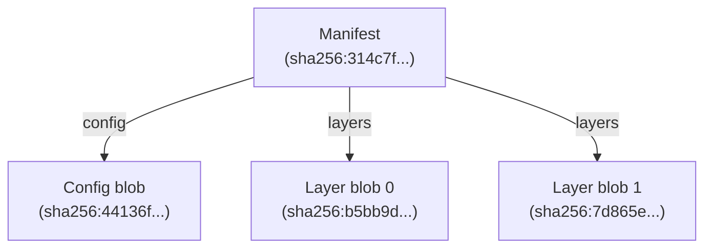

This graph is a [Merkle](https://en.wikipedia.org/wiki/Merkle_tree) Directed Acyclic Graph (DAG), where every object is a node uniquely identified by its digest. Since the digests are computed from the content and the content is fixed, every node itself in the graph is immutable.

In this graph, the manifest is the root of the graph, and the config or layer blobs are the leaf nodes referenced by the root.

## Artifact with Subject

When an artifact manifest is signed using tools such as [`notation`](https://github.com/notaryproject/notation), a signature manifest is created and attached to the artifact manifest being signed. The signature manifest references a signature blob and specifies a `subject` field that points to the target artifact manifest.

The following example demonstrates a signature manifest:

```json
{
  "schemaVersion": 2,
  "mediaType": "application/vnd.oci.image.manifest.v1+json",
  "config": {
    "mediaType": "application/vnd.cncf.notary.signature",
    "digest": "sha256:44136fa355b3678a1146ad16f7e8649e94fb4fc21fe77e8310c060f61caaff8a",
    "size": 2
  },
  "layers": [
    {
      "mediaType": "application/jose+json",
      "digest": "sha256:37f88486592fd90ace303ee38f8d1ff698193e76c76d3c1fef8627a39e677696",
      "size": 2090
    }
  ],
  "subject": {
    "mediaType": "application/vnd.oci.image.manifest.v1+json",
    "digest": "sha256:314c7f20dd44ee1cca06af399a67f7c463a9f586830d630802d9e365933da9fb",
    "size": 762
  },
  "annotations": {
    "io.cncf.notary.x509chain.thumbprint#S256": "[\"a9c85558943f197f41fe7cf3caf691f7df8d0088be426a33d895560717893962\"]",
    "org.opencontainers.image.created": "2025-02-01T09:50:52Z"
  }
}
```

This signature manifest indicates that the signature artifact contains one config blob and one layer blob, and its `subject` refers to the digest of the artifact manifest in the [above example](#simple-artifact). This signature manifest is considered a `Referrer` of the artifact manifest.

When stored in the CAS, the digest computed from the signature manifest content is:
`sha256:e5727bebbcbbd9996446c34622ca96af67a54219edd58d261112f1af06e2537c`.

The relationship between the artifact and its signature appears in the graph below:

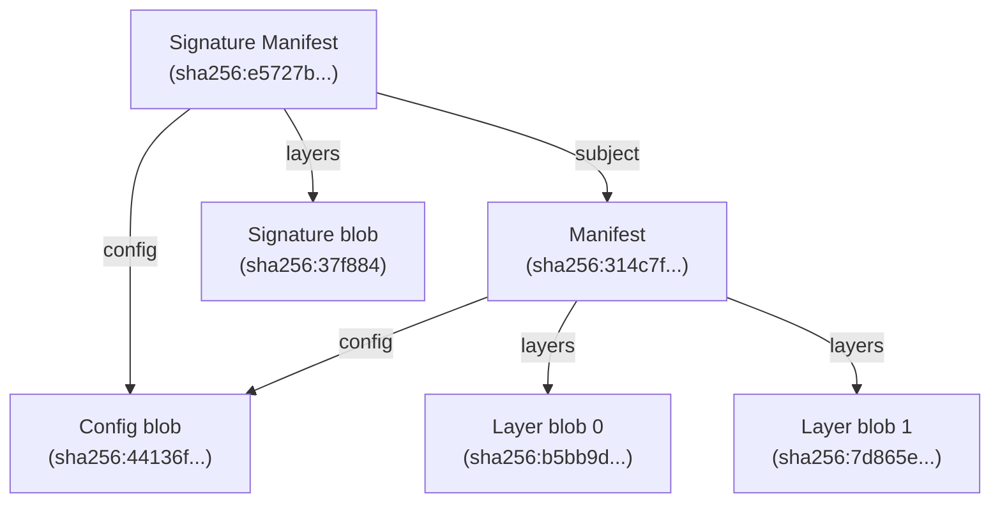

In this model, the signature manifest acts as the root for the combined graph, while the artifact manifest is the root of its own subgraph.

Note that because the config blob of the artifact and the signature is the same, it is stored only once in the CAS and appears as only one node. This is a common case and it's why artifacts are modeled as graphs instead of trees.

## Index of Artifacts

An [OCI Index](https://github.com/opencontainers/image-spec/blob/v1.1.1/image-index.md) can also be created for collecting multiple manifests.
For example, an Index referencing two manifests would look like:

```json
{
  "schemaVersion": 2,
  "mediaType": "application/vnd.oci.image.index.v1+json",
  "manifests": [
    {
      "mediaType": "application/vnd.oci.image.manifest.v1+json",
      "digest": "sha256:314c7f20dd44ee1cca06af399a67f7c463a9f586830d630802d9e365933da9fb",
      "size": 762
    },
    {
      "mediaType": "application/vnd.oci.image.manifest.v1+json",
      "digest": "sha256:eba50b7b7dfdf6294a375a3376b2b74e3b926c75119f7da04b1c671c7de662c9",
      "size": 588
    }
  ]
}
```

When stored in a CAS, the digest computed for this Index is:
`sha256:9c7c6bfa51dac3c9dfeffc7a0a795c30101f1f60afa64739767cedd92f574570`.

The relationship between the Index and the artifacts in the CAS can be modeled as the graph below:

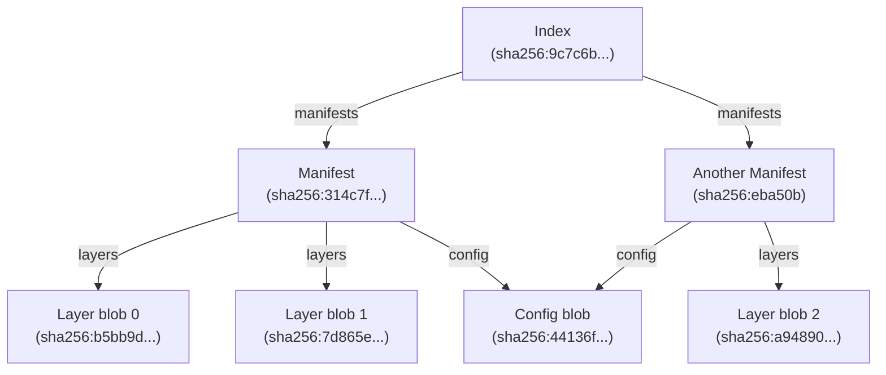

In this graph, the Index serves as the root of the overall graph, with each manifest defining the root of its corresponding artifact subgraph.

## Graph Concepts

A complex DAG may integrate artifacts, their referrers, and the Indexes that reference them. The following example demonstrates such a graph:

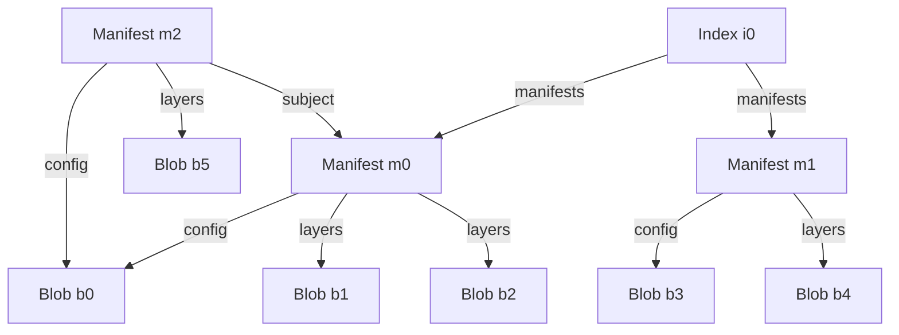

For any node in the graph, the following definitions apply:

- **Successor:** Any node that is pointed to by a given node. For instance:
  - Blob `b0` is a successor of both `m0` and `m2`
  - Manifest `m0` is a successor of `m2` and `i0`
  
- **Predecessor:** Any non-leaf node that directly points to a given node. For instance:
  - Manifest `m0` is a predecessor of `b0`, `b1`, and `b2`
  - Manifest `m2` is a predecessor of `b0`, `b5`, and `m0`
  - Index `i0` is a predecessor of `m0` and `m1`

These definitions apply to nodes of any type—manifests, indexes, or arbitrary blobs.

However, the referrer relationship is different. A manifest (including [Image Manifest](https://github.com/opencontainers/image-spec/blob/v1.1.1/manifest.md) and [Index](https://github.com/opencontainers/image-spec/blob/v1.1.1/image-index.md)) with a `subject` field is considered a referrer of that subject manifest. According to [OCI image-spec v1.1.1](https://github.com/opencontainers/image-spec/blob/v1.1.1/manifest.md), both the `referrer` and the `subject` must be manifests.

So, it is worth noting that:

- `m0` is a `subject` of `m2`, and it is a successor of both `m2` and `i0`
- `m2` is a referrer of `m0`, and it is a predecessor of `m0`, `b0`, and `b5`

Defining functions `Predecessors()`, `Successors()`, and `Referrers()`, the example result would be:

```
  Successors(m0) == [b0, b1, b2]
Predecessors(m0) == [m2, i0]
   Referrers(m0) == [m2]

  Successors(m2) == [m0, b0, b5]
Predecessors(m2) == []
   Referrers(m2) == []

  Successors(b0) == []
Predecessors(b0) == [m0, m2]
   Referrers(b0) == []
```

### Copy

Given the root node of a Directed Acyclic Graph (DAG), the `Copy` function replicates the graph reachable from that root node from one Content-Addressable Storage (CAS) to another. This is achieved by recursively invoking the `Successors()` function to traverse and copy all descendant nodes in a certain order.

Taking the [graph above](#graph-concepts) as an example:

`Copy(m0)` copies the graph rooted by the node `m0`, including `m0` itself and all of its successors `b0`, `b1`, and `b2`.

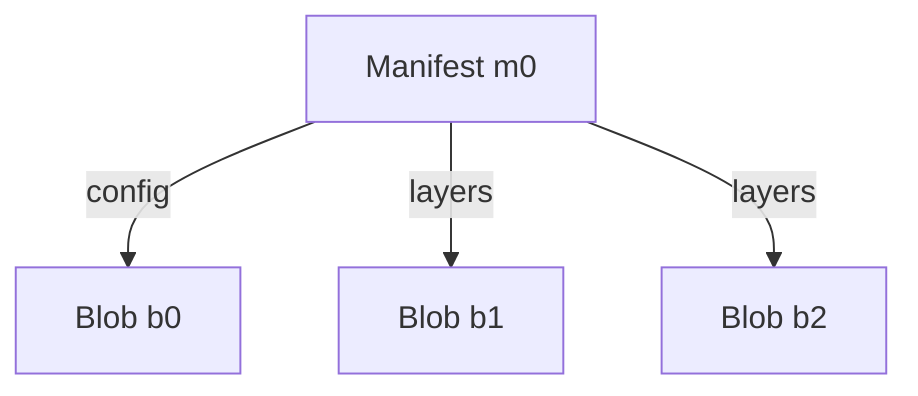

`Copy(m2)` copies the graph rooted at the node `m2`, including `m2` itself, its successor `b5`, and the subgraph rooted at `m0`.

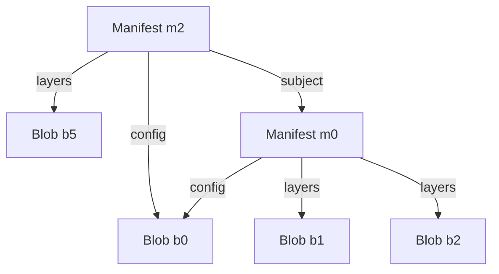

`Copy(b0)` copies itself only as it has no successor.

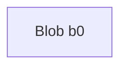

### Extended Copy

As an extension to the `Copy` function, the `ExtendedCopy` function is designed to replicate the entire graph reachable from any given node in a DAG. This method requires that the source CAS supports predecessor finding (i.e., it indexes predecessor relationships when storing the graph).

The predecessor relationship for the [example graph](#graph-concepts) looks like this:

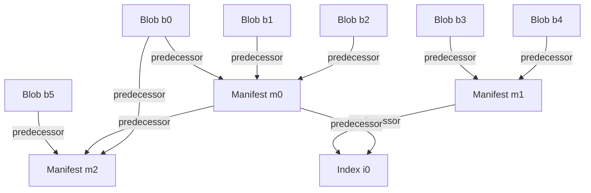

With the predecessor finding capability, `ExtendedCopy` recursively calls `Predecessors()` to discover root nodes, then applies `Copy` on each discovered root. For instance:

`ExtendedCopy(b5)` finds out the root node `m2` starting from `b5`, and copies the graph rooted at `m2`:


`ExtendedCopy(m1)` determines the root node `i0` from `m1`, and copies the graph rooted at `i0`:

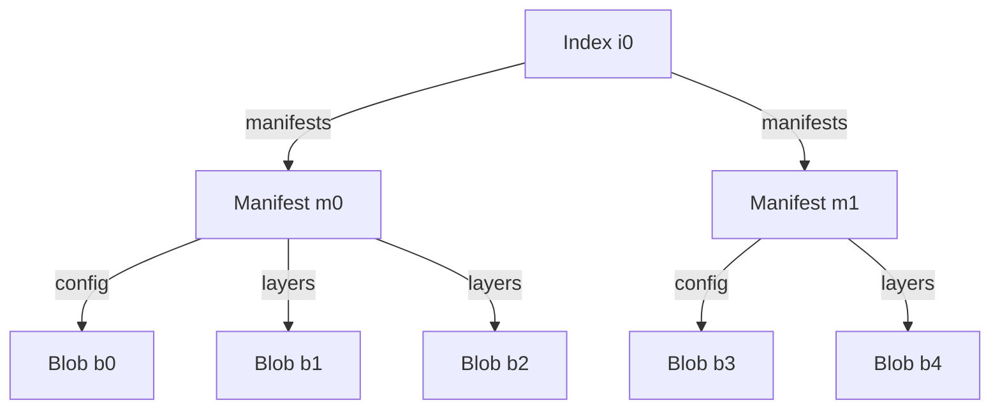

`ExtendedCopy(b0)` finds multiple root nodes `m2` and `i0` starting from `b0`, then copies the combined graph rooted at  `m2` and `i0`:


#### Referrers API / Referrers Tag Schema

Many CAS implementations, such as artifact registries, support referrers discovery via the [Referrers API](https://github.com/opencontainers/distribution-spec/blob/v1.1.1/spec.md#listing-referrers) but do not support general predecessor finding.
When interacting with artifact registries, if Referrers API is not available, `oras-go` will fallback to the [Referrers Tag Schema](https://github.com/opencontainers/distribution-spec/blob/v1.1.1/spec.md#referrers-tag-schema) approach, which simulates the behavior of the Referrers API through some client-side efforts.

In these systems, the `Predecessors` function essentially operates as `Referrers`.

The referrer/subject relationship for the [example graph](#graph-concepts) looks like this:

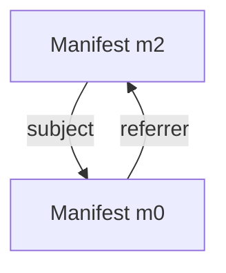

When replicating graphs from source artifact registries to another CAS, the limited predecessor finding functionality restricts the set of nodes that can be copied.

For example, `ExtendedCopy(m0)` can only find the root node `m2` starting from `m0` and will copy the graph rooted at `m2`. In this case, `i0` is not reachable from `m0` because there is no referrer/subject relationship between `i0` and `m2`.


`ExtendedCopy(m1)` finds no referrer of `m1`, so it just copies the graph rooted `m1`.

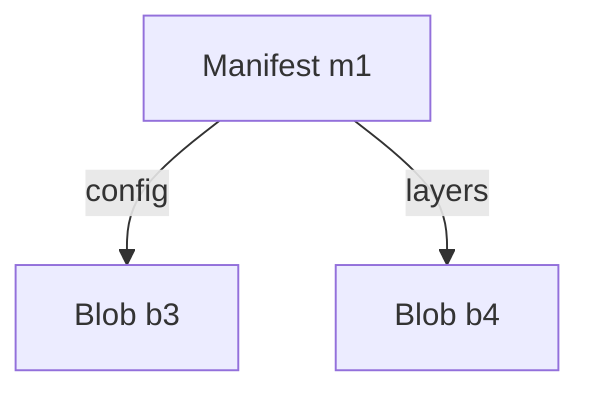