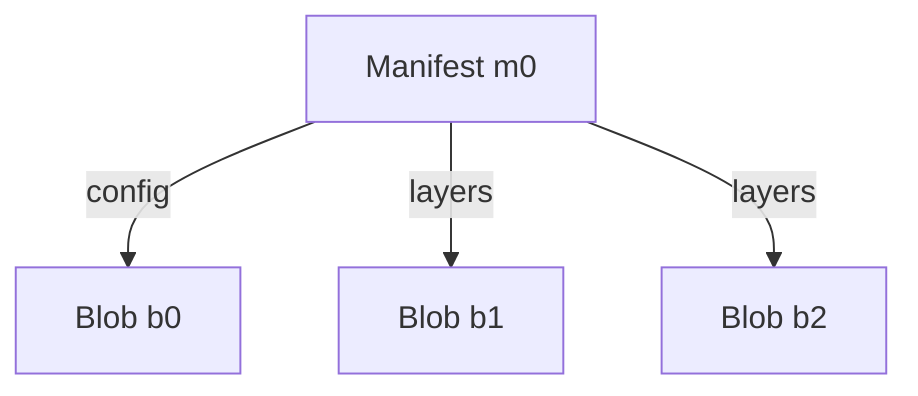
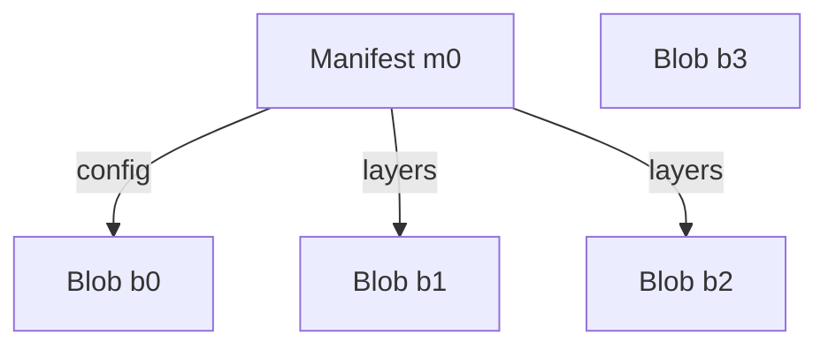

# Targets in ORAS Go v2

Prerequisite reading: [Modeling Artifact](./Artifacts-Model.md)

## Interfaces

In ORAS Go v2, artifacts are modeled as [Directed Acyclic Graphs (DAGs)](https://en.wikipedia.org/wiki/Directed_acyclic_graph) stored in [Content-Addressable Storages (CASs)](https://en.wikipedia.org/wiki/Content-addressable_storage). Each node in the graph can be represented by their [descriptors](https://github.com/opencontainers/image-spec/blob/v1.1.0/descriptor.md).

A descriptor should at least contains the following three required properties:

- `mediaType`: the media type of the referenced content
- `digest`: the digest of the targeted content
- `size`: the size, in bytes, of the raw content

Here is an example of the descriptor of an image manifest:

```json
{
  "mediaType": "application/vnd.oci.image.manifest.v1+json",
  "size": 7682,
  "digest": "sha256:5b0bcabd1ed22e9fb1310cf6c2dec7cdef19f0ad69efa1f392e94a4333501270"
}
```

Based on the concepts of graph modeling and descriptors, the following mayjor interfaces are defined in ORAS Go v2:

- `Storage`
- `Target`

### Storage

The `Storage` interface represents a content-addressable storage (CAS) where contents are accessed via their descriptors, it provides the following functions:

- `Fetch`: fetches the content identified by the descriptor from the CAS.
- `Exists`: checks if the described content exists in the CAS or not.
- `Push`: pushes the content matching the expected descriptor to the CAS.

Suppose there is such a graph stored in a storage, where the name of each node is the alias of their descriptors:



The effects of the `Fetch` and `Exists` functions would be like this:

```
Fetch(m0) == content_m0

Exists(b0) == true
Exists(b3) == false
```

If a new blob `b3` is pushed to the storage, the graph would become:



#### PredecessorFinder

The `PredecessorFinder` interfaces is an extension to `Storage`, it provides only one function:

- `Prdecessors`: finds out the nodes directly pointing to a given node in the graph.

The effects of the `Predecessors` function called against the same graph would be like this:

```
Predecessors(b0) == [m0]
Predecessors(m0) == []
```

### Target

