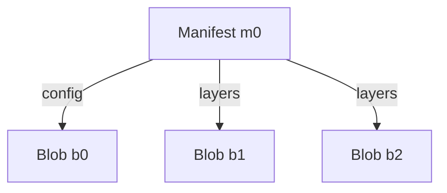
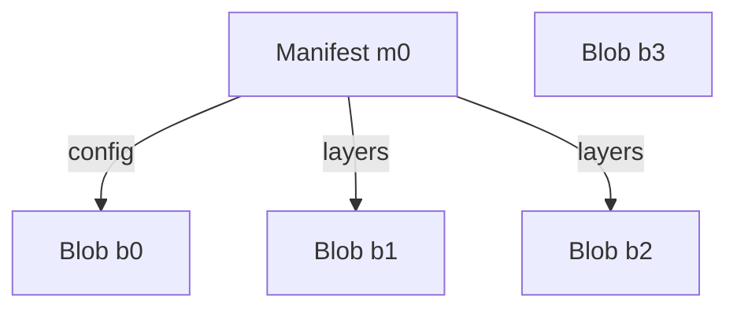
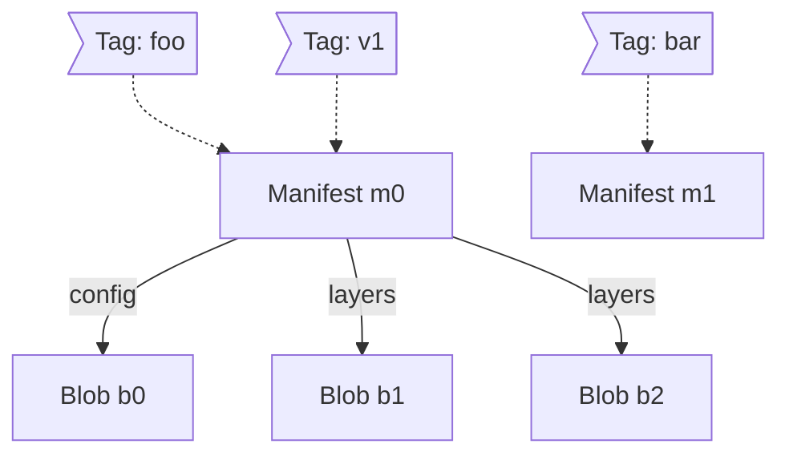
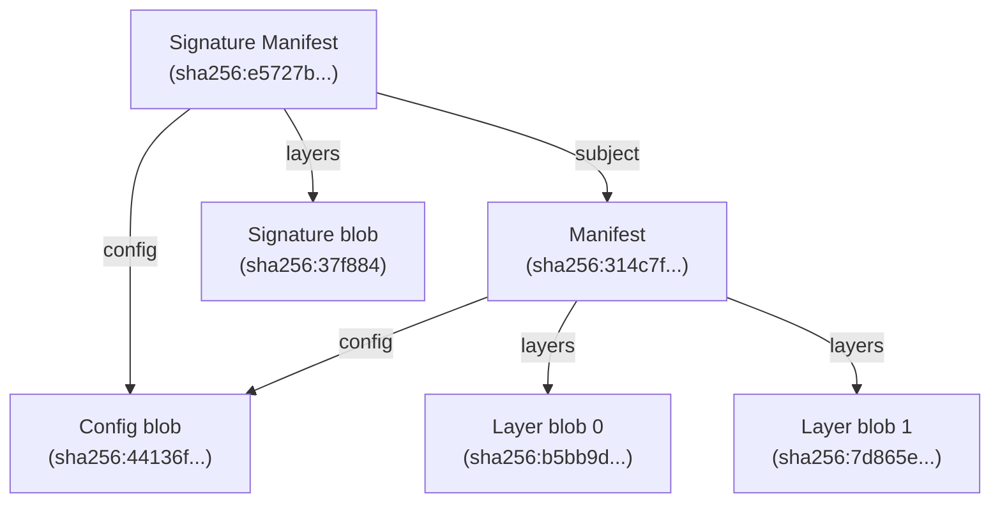
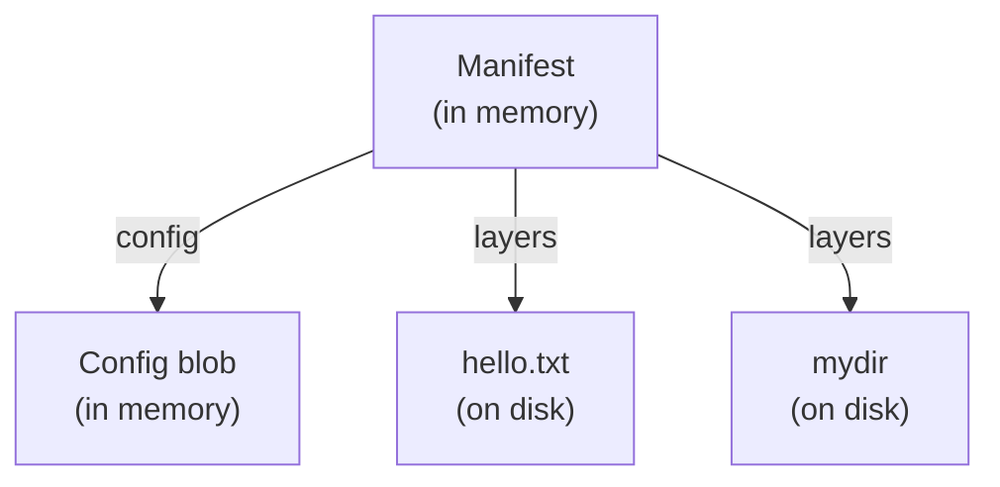
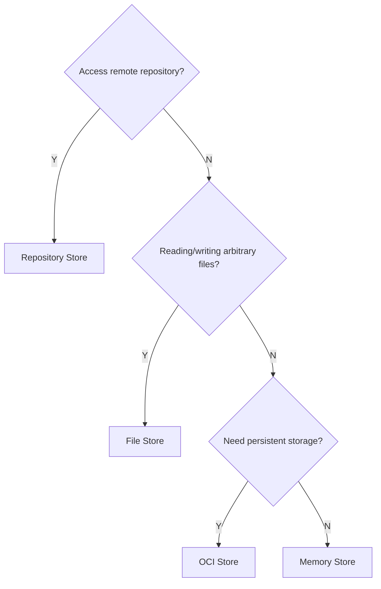

# Targets and Content Stores in `oras-go` v2

> [!IMPORTANT]
> Prerequisite reading: [Modeling Artifact](./Modeling-Artifacts.md)

In `oras-go` v2, artifacts are modeled as [Directed Acyclic Graphs (DAGs)](https://en.wikipedia.org/wiki/Directed_acyclic_graph) stored in [Content-Addressable Storages (CASs)](https://en.wikipedia.org/wiki/Content-addressable_storage). Each node in the graph represents a [descriptor](https://github.com/opencontainers/image-spec/blob/v1.1.1/descriptor.md) of the content, which must include the following three properties:

- `mediaType`: The media type of the referenced content.
- `digest`: The digest of the targeted content.
- `size`: The size, in bytes, of the raw content.

An example of a descriptor for an [OCI Image Manifest](https://github.com/opencontainers/image-spec/blob/v1.1.1/manifest.md) is shown below:

```json
{
  "mediaType": "application/vnd.oci.image.manifest.v1+json",
  "size": 7682,
  "digest": "sha256:5b0bcabd1ed22e9fb1310cf6c2dec7cdef19f0ad69efa1f392e94a4333501270"
}
```

## Interfaces

`oras-go` v2 defines four major interfaces based on the graph-modeling concepts and descriptors: [`Storage`](#storage), [`GraphStorage`](#graphstorage), [`Target`](#target), and [`GraphTarget`](#graphtarget).

### Storage

The [`Storage`](https://pkg.go.dev/oras.land/oras-go/v2/content#Storage) interface represents a content-addressable storage (CAS) where content is accessed via descriptors. It provides the following functions:

- `Fetch`: Retrieves the content identified by the descriptor from the CAS.
- `Exists`: Checks whether the described content is present in the CAS.
- `Push`: Adds content matching the expected descriptor to the CAS.

For example, consider the following graph stored in a `Storage`, where node names are aliases for descriptors:



The effects of the `Fetch` and `Exists` functions would be:

```
Fetch(m0) == content_m0

Exists(b0) == true
Exists(b3) == false
```

If a new blob `b3` is pushed to the storage, the graph would update as follows:



### GraphStorage

The [`GraphStorage`](https://pkg.go.dev/oras.land/oras-go/v2/content#GraphStorage) interface extends [`Storage`](#storage) by adding support for predecessor finding. It provides the following functions:

- `Fetch`
- `Exists`
- `Push`
- **`Predecessors`**: Finds the nodes directly pointing to a given node in the graph.

For the [same graph](#storage), the `Predecessors` function would act as follows:

```
Predecessors(b0) == [m0]
Predecessors(m0) == []
```

### Target

The [`Target`](https://pkg.go.dev/oras.land/oras-go/v2#Target) interface represents a CAS with tagging capability. It provides the following functions:

- `Fetch`
- `Exists`
- `Push`
- **`Resolve`**: Resolves a tag string to a descriptor.
- **`Tag`**: Associates a descriptor with a tag string.

For example, consider a graph stored in a Target where `m0` is associated with two tags, `"foo"` and `"bar"`:


The effects of the `Resolve` function would be:

```
  Resolve("foo") == m0
  Resolve("bar") == m0
Resolve("hello") == nil
```

If a new tag `"v1"` is added to `m0`, the graph would update as follows:


A descriptor can have multiple tags, but each tag is associated with only one descriptor. Reusing a tag for a different descriptor removes its previous association.

If the tag `"bar"` is reused on another manifest `m1`, the graph would update as follows:



### GraphTarget

The [`GraphTarget`](https://pkg.go.dev/oras.land/oras-go/v2#GraphTarget) interface combines the capabilities of [`GraphStorage`](#graphstorage) and [`Target`](#target). It provides the following functions:

- `Fetch`
- `Exists`
- `Push`
- `Resolve`
- `Tag`
- `Predecessors`

## Content Stores

In `oras-go` v2, a content store is an implementation of the [`Target`](#target) interface—specifically, the [`GraphTarget`](#graphtarget) interface.

The library provides four built-in content stores:

- [Memory Store](#memory-store): Stores everything in memory.
- [OCI Store](#oci-store): Stores content in the [OCI-Image layout](https://github.com/opencontainers/image-spec/blob/v1.1.1/image-layout.md) on the file system.
- [File Store](#file-store): Stores location-addressable content on the file system.
- [Repository Store](#repository-store): Communicates with remote artifact repositories (e.g. `ghcr.io`, `docker.io`).

### Memory Store

The memory store, available in the [`content/memory`](https://pkg.go.dev/oras.land/oras-go/v2/content/memory) package, stores all content in memory, where each blob's content is mapped to its corresponding descriptor.

> [!TIP]
> The memory store is often used for building and storing artifacts in memory before copying them to other stores, such as remote repositories.

### OCI Store

The OCI store, available in the [`content/oci`](https://pkg.go.dev/oras.land/oras-go/v2/content/oci) package, follows the OCI [`image-spec v1.1.1`](https://github.com/opencontainers/image-spec/blob/v1.1.1/image-layout.md) to store blob content on the file system. 

For example, consider an artifact and its signature represented by the following graph:



The corresponding directory structure on the file system would look like this:

```bash
$ tree repo
repo/
├── blobs
│   └── sha256
│       ├── 314c7f20dd44ee1cca06af399a67f7c463a9f586830d630802d9e365933da9fb
│       ├── 37f88486592fd90ace303ee38f8d1ff698193e76c76d3c1fef8627a39e677696
│       ├── 44136fa355b3678a1146ad16f7e8649e94fb4fc21fe77e8310c060f61caaff8a
│       ├── 7d865e959b2466918c9863afca942d0fb89d7c9ac0c99bafc3749504ded97730
│       ├── b5bb9d8014a0f9b1d61e21e796d78dccdf1352f23cd32812f4850b878ae4944c
│       └── e5727bebbcbbd9996446c34622ca96af67a54219edd58d261112f1af06e2537c
├── index.json
├── ingest
└── oci-layout
```

In the layout:

- All content, whether manifests or layer blobs, are all placed under the `blobs` directory.
- The path to each piece of content is determined by its digest.
- The `index.json` file is an [Image Index](https://github.com/opencontainers/image-spec/blob/v1.1.1/image-layout.md#index-example) JSON object. It serves as the entry point for the graph and provides tagging functionality.
- The `ingest` directory is used temporarily during blob processing. It can be safely removed after the push operation and should be cleaned up before creating a tar archive of the OCI layout. This directory is not defined in the OCI specification. 
- The `oci-layout` file is a marker of the base of the OCI Layout.

The OCI Layout offers several advantages:

- It is fully compliant with OCI `image-spec v1.1.1`, ensuring compatibility with tools beyond ORAS.
- Its clean and straightforward structure makes it easy to manage and replicate.

> [!TIP]
> The OCI store is a practical option for maintaining a local copy of a remote repository.

### File Store

The file store, available in the [`content/file`](https://pkg.go.dev/oras.land/oras-go/v2/content/file) package, supports both content-addressable and location-addressable storage. It is designed for packaging arbitrary files or directories and allows adding them directly from the local file system.

When a file or directory is added, the file store creates a descriptor containing annotations with essential metadata. The process differs depending on whether a file or a directory is added:

- **File Addition**: When a file is added, its contents are stored as a blob. A descriptor is generated from the blob with an `"org.opencontainers.image.title"` annotation indicating the original file name.
- **Directory Addition**: When a directory is added, it is first tar-archived and compressed into a blob. The descriptor generated for a directory includes multiple annotations:
  - `"org.opencontainers.image.title"`: Indicates the original directory name.
  - `"io.deis.oras.content.digest"`**(ORAS-specific)**: Represents the digest of the tar'ed content before compression.
  - `"io.deis.oras.content.unpack"`**(ORAS-specific)**: A flag indicating that the blob represents a directory that needs to be decompressed and un-tar'ed.

For example, consider the following directory structure on disk:

```bash
$ tree
.
├── hello.txt
└── mydir
    ├── bar.txt
    └── foo.txt

$ cat hello.txt
hello

$ cat mydir/foo.txt
foo

$ cat mydir/bar.txt
bar
```

Adding the file `hello.txt` results in a blob with a descriptor similar to this:

```json
{
  "mediaType": "application/vnd.custom",
  "digest": "sha256:5891b5b522d5df086d0ff0b110fbd9d21bb4fc7163af34d08286a2e846f6be03",
  "size": 6,
  "annotations": {
    "org.opencontainers.image.title": "hello.txt"
  }
}
```

Adding the directory `mydir` results in a tar-archived and compressed blob with a descriptor similar to this:

```json
{
  "mediaType": "application/vnd.custom.tar+gzip",
  "digest": "sha256:b14fa80f5afd3822dce52a711566586c8f89e5dc211e4b0d2819f219b102fe7a",
  "size": 164,
  "annotations": {
    "io.deis.oras.content.digest": "sha256:9d418a0549e5bc45d195aacec889d30e520b9f2bd9feab57d57de6d9cdd66172",
    "io.deis.oras.content.unpack": "true",
    "org.opencontainers.image.title": "mydir"
  }
}
```

To create an artifact, a manifest needs to be [packed](https://pkg.go.dev/oras.land/oras-go/v2#PackManifest) to reference the two blobs and will also be stored in the file store. The manifest content might look like this:

```json
{
  "schemaVersion": 2,
  "mediaType": "application/vnd.oci.image.manifest.v1+json",
  "artifactType": "application/vnd.example",
  "config": {
    "mediaType": "application/vnd.oci.empty.v1+json",
    "digest": "sha256:44136fa355b3678a1146ad16f7e8649e94fb4fc21fe77e8310c060f61caaff8a",
    "size": 2,
    "data": "e30="
  },
  "layers": [
    {
      "mediaType": "application/vnd.custom",
      "digest": "sha256:5891b5b522d5df086d0ff0b110fbd9d21bb4fc7163af34d08286a2e846f6be03",
      "size": 6,
      "annotations": {
        "org.opencontainers.image.title": "hello.txt"
      }
    },
    {
      "mediaType": "application/vnd.custom.tar+gzip",
      "digest": "sha256:b14fa80f5afd3822dce52a711566586c8f89e5dc211e4b0d2819f219b102fe7a",
      "size": 164,
      "annotations": {
        "io.deis.oras.content.digest": "sha256:9d418a0549e5bc45d195aacec889d30e520b9f2bd9feab57d57de6d9cdd66172",
        "io.deis.oras.content.unpack": "true",
        "org.opencontainers.image.title": "mydir"
      }
    }
  ],
  "annotations": {
    "org.opencontainers.image.created": "2025-03-07T08:34:23Z"
  }
}
```

In the file store, blobs with names are location-addressed by file paths, while other content (e.g., manifests and config blobs) is maintained in fallback storage. By default, the fallback storage is a limited in-memory CAS store.

For the above example, the graph stored in the file store would be like this:



Unlike the OCI store, the file store only persists named contents (e.g., `hello.txt` and `mydir`) on disk, while all metadata is stored in memory.

> [!IMPORTANT]
> Once the file store is terminated, it cannot be restored to its original state from the file system.

### Repository Store

The repository store, available in the [`registry/remote`](https://pkg.go.dev/oras.land/oras-go/v2/registry/remote) package, communicates with remote artifact repositories using APIs defined in the [OCI distribution-spec v1.1.1](https://github.com/opencontainers/distribution-spec/blob/v1.1.1/spec.md).

Unlike other content stores, the repository store handles manifests and non-manifest blobs separately. This distinction exists because the URI paths for manifests and blobs differ, with manifests accessed via `/v2/<name>/manifests/` and blobs accessed via `/v2/<name>/blobs/`.

The repository store manages manifests through the `ManifestStore` sub-store and handles blobs through the `BlobStore` sub-store. It automatically determines which sub-store to use based on the media type specified in the descriptor.

It is important to note that, the `ManifestStore` implements the `Predecessors` function based on the [Referrers API](https://github.com/opencontainers/distribution-spec/blob/v1.1.1/spec.md#listing-referrers) or, when the Referrers API is unavailable, [`Referrers Tag Schema`](https://github.com/opencontainers/distribution-spec/blob/v1.1.1/spec.md#unavailable-referrers-api). However, both approaches only support referrer discovery and do not provide generic predecessor finding.

Below is a mapping of major repository functions to their corresponding registry API endpoints:

#### Manifest Store Mappings

| Function Name  | API endpoint                                                                                                         |
| -------------- | -------------------------------------------------------------------------------------------------------------------- |
| `Fetch`        | GET `/v2/<name>/manifests/<reference>`                                                                               |
| `Exists`       | HEAD `/v2/<name>/manifests/<reference>`                                                                              |
| `Push`         | PUT `/v2/<name>/manifests/<reference>`                                                                               |
| `Resolve`      | HEAD `/v2/<name>/manifests/<reference>`                                                                              |
| `Tag`          | PUT `/v2/<name>/manifests/<reference>`                                                                               |
| `Predecessors` | GET `/v2/<name>/referrers/<digest>?artifactType=<artifactType>`<br>Fallback to `Referrers Tag Schema` if unavailable |

#### Blob Store Mappings

| Function Name | API endpoint                                                                                   |
| ------------- | ---------------------------------------------------------------------------------------------- |
| `Fetch`       | GET `/v2/<name>/blobs/<reference>`                                                             |
| `Exists`      | HEAD `/v2/<name>/blobs/<reference>`                                                            |
| `Push`        | POST `/v2/<name>/blobs/uploads/`<br>PUT `/v2/<name>/blobs/uploads/<reference>?digest=<digest>` |
| `Resolve`     | HEAD `/v2/<name>/blobs/<reference>`                                                            |

### Summary of Content Stores

| Name             | Description                                                                        | Persistent Storage             | Predecessors Support        | Scenarios                                  |
| ---------------- | ---------------------------------------------------------------------------------- | ------------------------------ | --------------------------- | ------------------------------------------ |
| Memory Store     | Stores everything in memory                                                        | No                             | Yes                         | Memory caching, testing                    |
| OCI Store        | Stores content in OCI-Image layout on the file system                              | Yes                            | Yes                         | Local cache or copy of remote repositories |
| File Store       | Stores location-addressable content on file system                                 | Partial (For named blobs only) | Yes                         | Packaging arbitrary files                  |
| Repository Store | Communicates with remote artifact repositories (e.g. `ghcr.io`, `docker.io`, etc.) | Yes                            | Partial (via Referrers API) | Accessing remote repositories              |

### How to Choose the Appropriate Content Store


