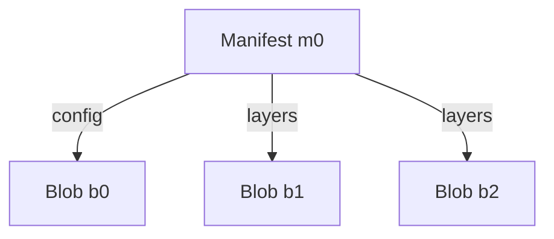
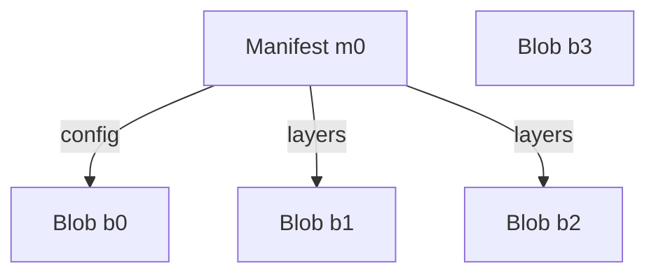
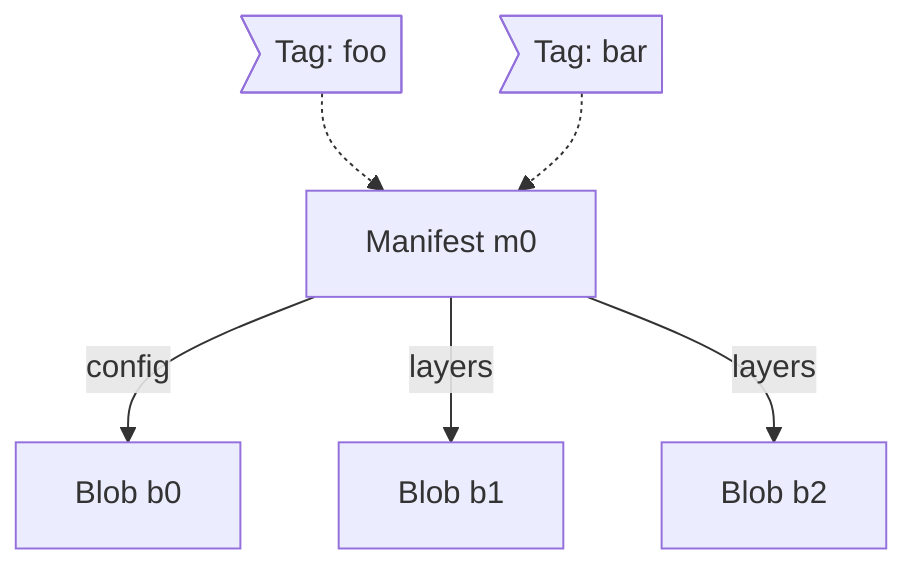
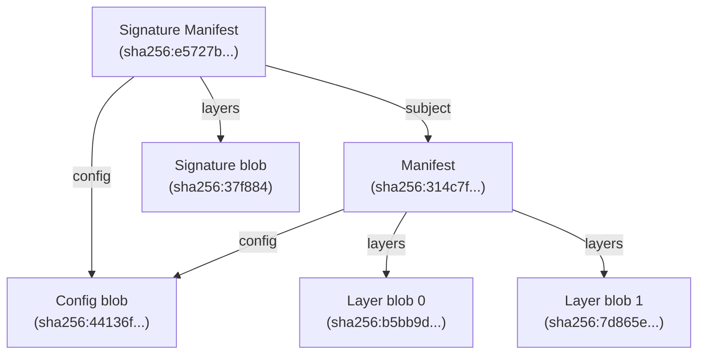

# Targets in ORAS Go v2

Prerequisite reading: [Modeling Artifact](./Artifacts-Model.md)

In ORAS Go v2, artifacts are modeled as [Directed Acyclic Graphs (DAGs)](https://en.wikipedia.org/wiki/Directed_acyclic_graph) stored in [Content-Addressable Storages (CASs)](https://en.wikipedia.org/wiki/Content-addressable_storage). Each node in the graph represents their [descriptors](https://github.com/opencontainers/image-spec/blob/v1.1.0/descriptor.md).

A descriptor should at least contains the following three required properties:

- `mediaType`: the media type of the referenced content
- `digest`: the digest of the targeted content
- `size`: the size, in bytes, of the raw content

Here is an example of the descriptor of an image manifest:

```json
{
  "mediaType": "application/vnd.oci.image.manifest.v1+json",
  "size": 7682,
  "digest": "sha256:5b0bcabd1ed22e9fb1310cf6c2dec7cdef19f0ad69efa1f392e94a4333501270"
}
```

## Interfaces

Based on the concepts of graph modeling and descriptors, the following mayjor interfaces are defined in ORAS Go v2.

### Storage

The `Storage` interface represents a content-addressable storage (CAS) where contents are accessed via their descriptors, it provides the following functions:

- `Fetch`: fetches the content identified by the descriptor from the CAS.
- `Exists`: checks if the described content exists in the CAS or not.
- `Push`: pushes the content matching the expected descriptor to the CAS.

Suppose there is such a graph stored in a `Storage`, where the name of each node is the alias of their descriptors:



The effects of the `Fetch` and `Exists` functions would be like this:

```
Fetch(m0) == content_m0

Exists(b0) == true
Exists(b3) == false
```

If a new blob `b3` is pushed to the storage, the graph would become:



#### GraphStorage

The `GraphStorage` interface represents a CAS with support of predecessors finding. It provides the following functions:

- `Fetch`
- `Exists`
- `Push`
- **`Prdecessors`**: finds out the nodes directly pointing to a given node in the graph.

The effects of the `Predecessors` function called against the same graph would be like this:

```
Predecessors(b0) == [m0]
Predecessors(m0) == []
```

### Target

The `Target` interface represents a CAS with tagging capability. It provides the following functions:

- `Fetch`
- `Exists`
- `Push`
- **`Resolve`**: resolves a tag string to a descriptor.
- **`Tag`**: tags a descriptor with a tag string.

Suppose there is such a graph stored in a `Target`, where `m0` is associated with two tags `"foo"` and `"bar"`:



The effects of the `Resolve` function would be like this:

```
Resolve("foo") == m0
Resolve("bar") == m0
Resolve("hello") == nil
```

If a new tag "v1" is tagged on `m0`, the graph would become:


### GraphTarget

The `GraphTarget` interface represents a CAS with tagging capability and supports predecessors finding. It provides the following functions:

- `Fetch`
- `Exists`
- `Push`
- `Resolve`
- `Tag`
- `Predecessors`

## Content Stores

In ORAS Go v2, a content store is an implementation of `Target`, more specifically, `GraphTarget`.

There are four built-in content stores defined in the library, they are:

- Memory Store: An in-memory implementation
- OCI Store: Stores content in format of OCI-Image layout on file system
- File Store: Stores location-addressable content on file system
- Repository Store: Represents a remote artifact repository (e.g. `ghcr.io`, `docker.io`, etc.)

### Memory Store

The memory store is available in the `content/memory` package, it stores everything in memory where blob content are mapped to their descriptor.

One common scenario for using a memory store is to build and store an artifact in the memory store first, and then later copy it as a whole to other stores, such as remote repositories.

### OCI Store

The OCI store is available in the `content/oci` package, it follows the [`OCI image-spec v1.1.0`](https://github.com/opencontainers/image-spec/blob/v1.1.0/image-layout.md) to store the blob contents on file system.

Suppose there is an artifact and its signature, it can be represented in the graph below:



The directory structure for the graph on the file system would look like this:

```shell
$ tree repo

repo/
├── blobs
│   └── sha256
│       ├── 314c7f20dd44ee1cca06af399a67f7c463a9f586830d630802d9e365933da9fb
│       ├── 37f88486592fd90ace303ee38f8d1ff698193e76c76d3c1fef8627a39e677696
│       ├── 44136fa355b3678a1146ad16f7e8649e94fb4fc21fe77e8310c060f61caaff8a
│       ├── 7d865e959b2466918c9863afca942d0fb89d7c9ac0c99bafc3749504ded97730
│       ├── b5bb9d8014a0f9b1d61e21e796d78dccdf1352f23cd32812f4850b878ae4944c
│       └── e5727bebbcbbd9996446c34622ca96af67a54219edd58d261112f1af06e2537c
├── index.json
├── ingest
└── oci-layout
```

In the layout,

- All content, no mater of manifests or layer blobs, are all placed in the `blobs` directory, where the path to the content is the digest of the content.
- `index.json` is an Image Index JSON object, it serves as an entry point of the graph and a tagging system.
- `ingest` is a tempoprary directory for ingesting the blobs during processing, it not defined in the spec and is ORAS-specific.
- `oci-layout` is a marker of the base of the OCI Layout.

The OCI Layout has several advantages:

- It is `OCI image-spec v1.1.0` compliant and is compatible with other tools besides ORAS
- Its clean structure makes it easy to be managed and replicated

Based on these advantages, the OCI Store can be used as a local copy of a remote repository.

### File Store

### Repository Store

## How to choose the appropriate content store
