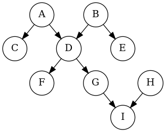

# Designing ORAS

## Introduction

[ORAS](https://oras.land/) is a tool for working with OCI artifacts, especially ones in the OCI registries. It provides user-friendly interfaces to push and pull artifacts to / from registries as well as options for advanced scenarios.

## Unified Experience

The objective of ORAS is simple as transferring artifacts from one place to another.

In the conventional [client-server model](https://en.wikipedia.org/wiki/Client%E2%80%93server_model), the operation of downloading artifacts from the remote registries is referred to as **pull**, and the operation of uploading artifacts to the remote registry is referred to as **push**.

This model can be generalized by abstracting the client and the server as **targets** so that pull and push can be viewed as **copying** from one target to another (see [**Copy API** oras-project/oras-go#8](https://github.com/oras-project/oras-go/pull/8)). For instances,

- Copy from memory to a remote registry.
- Copy from a remote registry to a local file folder.
- Copy from a remote registry to another remote registry.
- Copy from memory to a local file folder.

### Targets

Generally, a target is a [content-addressable storage (CAS)](https://en.wikipedia.org/wiki/Content-addressable_storage) with tags. All blobs in a CAS are addressed by their [descriptors](https://github.com/opencontainers/image-spec/blob/main/descriptor.md).

To retrieve a blob,

1. Get a descriptor. Optionally, it can be resolved by a tag.
2. Query the blob with a descriptor.

To store a blob,

1. Store the blob directly in the CAS. A descriptor will be returned.
2. Optionally, associate the returned descriptor with a tag.

It is worth noting that a target is not equal to a registry.

- Blobs can be tagged in a target but not in a registry.
- Tag list is available in a registry but not always available in a target.

### Graphs

Besides plain blobs, it is natural to store [directed acyclic graphs (DAGs)](https://en.wikipedia.org/wiki/Directed_acyclic_graph) in a CAS. Precisely, all blobs are leaf nodes and most manifests are non-leaf nodes.

An artifact is a rooted DAG where its root node is an [OCI manifest](https://github.com/opencontainers/image-spec/blob/main/manifest.md). Additionally, artifacts can be grouped by an [OCI index](https://github.com/opencontainers/image-spec/blob/main/image-index.md), which is also a rooted DAG.

Given a node of a DAG in a CAS, it is efficient to find out all its children. Since CASs are usually not enumerable or indexed, it is not possible to find the parent nodes of an arbitrary node. Nevertheless, some CASs choose to implement or partially implement the functionality of parent node finding. For instances, registries with [Manifest Referrers API](https://github.com/oras-project/artifacts-spec/blob/main/manifest-referrers-api.md) support are CASs with partially implementation where parent node finding is only available for manifest nodes.

### Extended Copy

With the concepts above, we can formally define that

- **Copy** is a function to replicate a rooted DAG from one CAS to another.
- **Extended Copy** is a function to replicate a DAG from one CAS to another.

It is worth noting that extended copy is possible only if the source CAS supports parent node finding. Based on the scenarios, extended copy can have many options such as opting to copy a sub-DAG rooted by a certain node and all its parent nodes of a certain depth with / without their children.

Optionally, node filters or even node modifiers can be attached to a copy process for advanced scenarios.

Related issues:

- [**Support copy of images and associated references** oras-project/oras-go#29](https://github.com/oras-project/oras-go/issues/29)
- [**Copy Artifact Reference Graph** oras-project/oras#307](https://github.com/oras-project/oras/issues/307)

Hint: A [polytree](https://en.wikipedia.org/wiki/Polytree) is a DAG.

