# ORAS Go v3 Registry Package Design

## Overview

This document describes the architecture of the `registry` and `registry/remote` packages in ORAS Go v3. It covers the package structure, key abstractions, data-flow diagrams, and the design rationale behind major subsystems.

---

## 1. Package Structure

```
registry/
├── interfaces.go         # Repository, BlobStore, ManifestStore, TagLister, etc.
├── reference.go          # Reference parsing and validation
│
└── remote/
    ├── registry.go       # Remote Registry (catalog, ping, repository lookup)
    ├── repository.go     # Remote Repository implementation (~64 KB)
    ├── builder.go        # ClientBuilder: factory for auth.Client + Repository
    ├── middleware.go      # RepositoryMiddleware, WithPolicyEnforcement, Compose
    ├── mirror.go         # Mirror fallback logic (PullFromMirrorAll/DigestOnly/TagOnly)
    ├── referrers.go      # Referrers API implementation
    ├── referrers_state.go # Atomic referrer capability state machine
    ├── auth.go           # Login/Logout helpers
    ├── warning.go        # RFC 7234 warning header handling
    ├── logging_transport.go # slog-based HTTP debug transport
    ├── url.go            # URL builder utilities
    │
    ├── auth/
    │   ├── client.go     # auth.Client: auth-decorated HTTP client
    │   ├── token.go      # TokenFetcher interface + Distribution/OAuth2/Composite impls
    │   ├── cache.go      # Token and auth-header caching
    │   ├── challenge.go  # WWW-Authenticate challenge parsing
    │   └── scope.go      # OAuth2 scope management
    │
    ├── credentials/
    │   ├── credential.go # Credential type (canonical location)
    │   ├── store.go      # Store interface + CredentialFunc
    │   ├── file_store.go # Docker config.json credential store
    │   ├── memory_store.go
    │   └── native_store.go # OS keychain integration
    │
    ├── properties/
    │   ├── registry.go   # Registry (Reference, Transport, Credential, Mirrors)
    │   ├── reference.go  # Reference (Registry, Repository, Tag, Digest)
    │   ├── transport.go  # Transport (TLS, PlainHTTP, HeaderFlags)
    │   ├── attributes.go # Attributes (ReferrersAPI capability hint)
    │   └── mirror.go     # Mirror (Location, Transport, PullFromMirror)
    │
    ├── config/
    │   ├── loader.go     # LoadConfigs / LoadConfigsWithOptions from system paths
    │   ├── config.go     # Docker config.json parser
    │   ├── registries.go # registries.conf / registries.d YAML parser
    │   ├── registriesd.go # registries.d directory support
    │   ├── certsd.go     # /etc/containers/certs.d certificate discovery
    │   └── properties.go # Configs → properties.Registry conversion
    │
    ├── policy/
    │   ├── policy.go     # Policy type + requirements (InsecureAcceptAnything, Reject, PRSignedBy)
    │   ├── evaluator.go  # Evaluator: IsImageAllowed
    │   ├── requirement.go # PolicyRequirement interface
    │   └── transport.go  # TransportName constants (docker, atomic, etc.)
    │
    ├── signature/
    │   ├── verifier.go   # DefaultSignedByVerifier: OpenPGP signature verification
    │   ├── storage.go    # SignatureStorage interface
    │   ├── lookaside.go  # LookasideStore: file:// and HTTP signature backends
    │   ├── simplesigning.go # atomic container signature payload format
    │   ├── openpgp.go    # CreateOpenPGPSignature helper
    │   └── identity.go   # matchRepoDigestOrExact identity matching
    │
    └── retry/
        ├── client.go     # Retry-decorated http.Client
        └── policy.go     # RetryPolicy interface + DefaultPolicy
```

---

## 2. Core Interfaces

### 2.1 Repository Interface Hierarchy

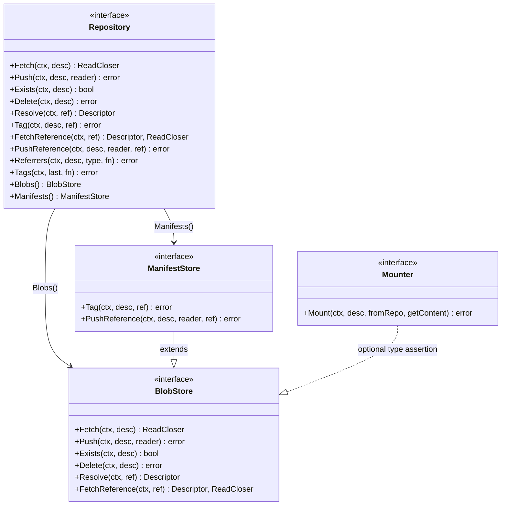

### 2.2 Content Package Interfaces (embedded)

`Repository` embeds several interfaces from the `content` package:

| Embedded Interface | Methods |
|---|---|
| `content.Storage` | `Fetch`, `Push`, `Exists` |
| `content.Deleter` | `Delete` |
| `content.TagResolver` | `Tag`, `Resolve` |
| `registry.ReferenceFetcher` | `FetchReference` |
| `registry.ReferencePusher` | `PushReference` |
| `registry.ReferrerLister` | `Referrers` |
| `registry.TagLister` | `Tags` |

---

## 3. Authentication Architecture

### 3.1 Component Relationships

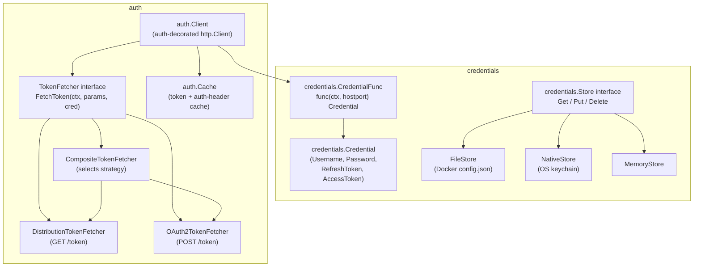

### 3.2 Authentication Flow

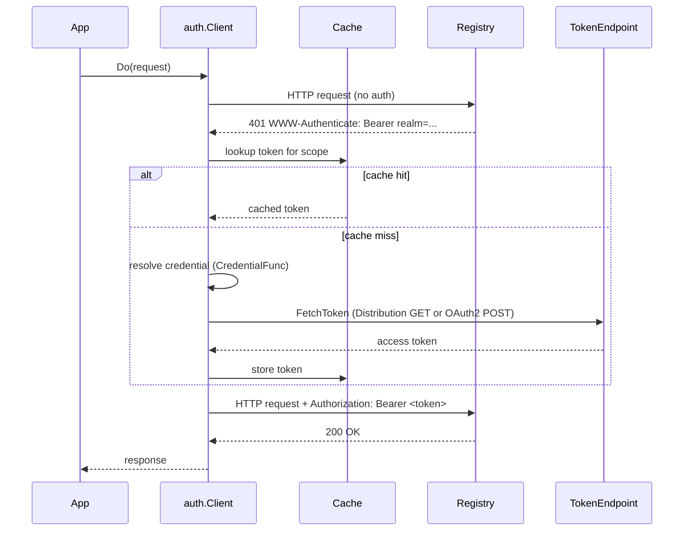

### 3.3 TokenFetcher Strategy Selection

`CompositeTokenFetcher` selects the token acquisition strategy at runtime:

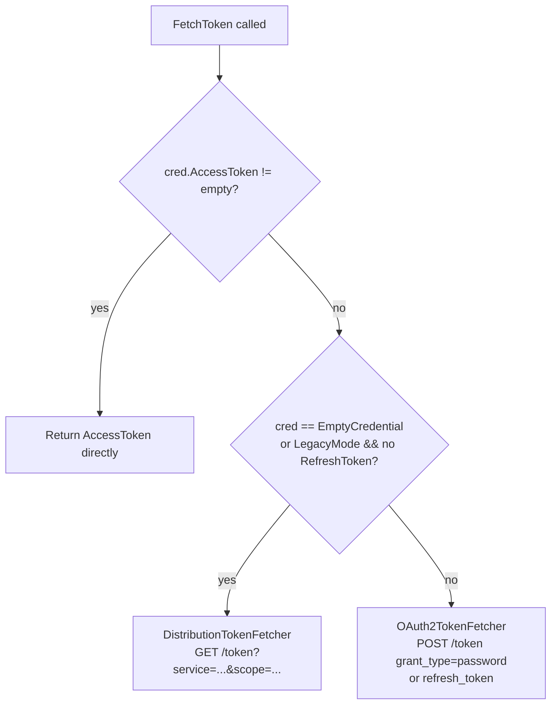

---

## 4. ClientBuilder and Registry Construction

`ClientBuilder` is the recommended factory for creating auth-configured clients and repositories. It replaces ad-hoc `auth.DefaultClient` usage.

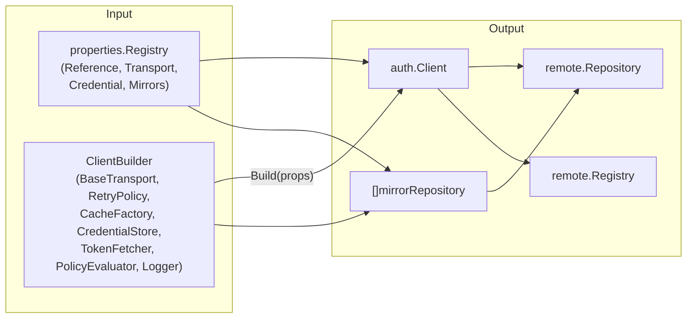

**Usage pattern:**

```go
builder := remote.NewClientBuilder()
builder.CredentialStore = myStore
builder.PolicyEvaluator = evaluator
builder.Logger = slog.Default()

props, _ := properties.NewRegistry("registry.example.com/app/myimage")
repo, _ := remote.NewRepositoryWithProperties(props, builder)
```

---

## 5. Mirror Fallback

When a repository has mirrors configured, read operations try mirrors in order before falling back to the primary.

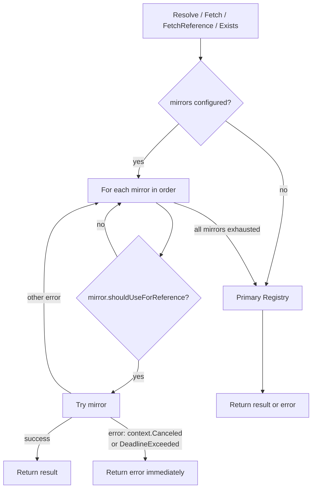

**Pull policies** (`PullFromMirror` field on `properties.Mirror`):

| Value | Behavior |
|---|---|
| `"all"` (default) | Use mirror for both tag and digest references |
| `"digest-only"` | Use mirror only for `@sha256:...` references |
| `"tag-only"` | Use mirror only for `:tag` references |

---

## 6. Middleware Pattern

`RepositoryMiddleware` is a function type that wraps a `registry.Repository`. Middlewares are composed with `Compose`.

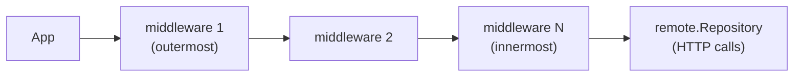

**Built-in middleware:**

```go
// Apply policy enforcement to an existing repository
enforced := remote.WithPolicyEnforcement(evaluator, policy.TransportNameDocker, scope)(repo)

// Compose multiple middlewares
composed := remote.Compose(
    remote.WithPolicyEnforcement(evaluator, policy.TransportNameDocker, scope),
    myLoggingMiddleware,
)(repo)
```

`policyEnforcingRepository` wraps all read and write methods — `Fetch`, `Push`, `Resolve`, `Tag`, `FetchReference`, `PushReference` — as well as the sub-stores returned by `Blobs()` and `Manifests()`.

---

## 7. Policy and Signature Verification

### 7.1 Package Relationships

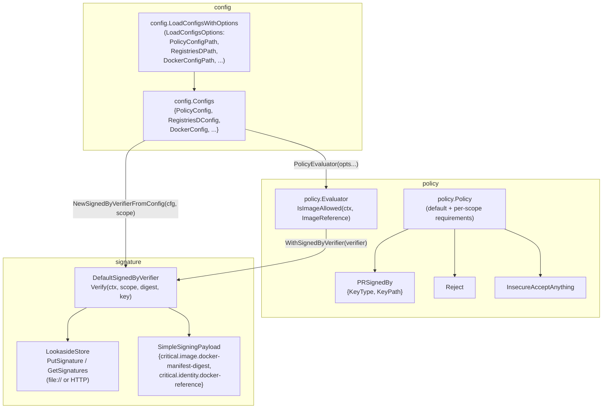

### 7.2 Signature Verification Flow

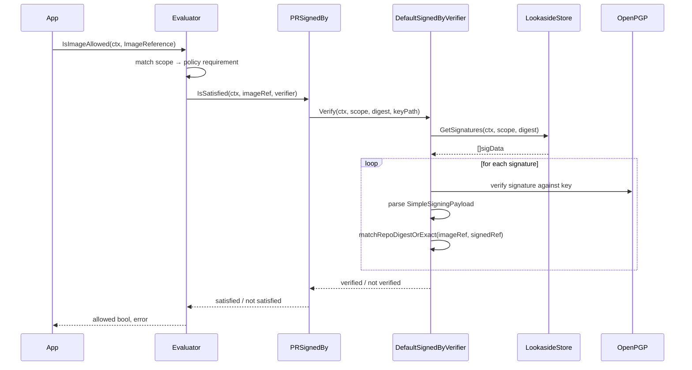

### 7.3 Config Loading

`config.LoadConfigsWithOptions` aggregates configuration from multiple sources:

| `LoadConfigsOptions` field | Source |
|---|---|
| `PolicyConfigPath` | `containers-policy.json` path (custom override) |
| `RegistriesDPath` | `registries.d` directory path (custom override) |
| `DockerConfigPath` | `config.json` path (custom override) |
| (defaults) | `/etc/containers/policy.json`, `~/.config/containers/registries.d`, `~/.docker/config.json` |

The returned `config.Configs` provides:
- `Configs.PolicyEvaluator(opts...)` — creates a `*policy.Evaluator`
- `config.NewSignedByVerifierFromConfig(cfg.RegistriesDConfig, scope)` — creates a `*signature.DefaultSignedByVerifier` via longest-prefix matching on the registries.d YAML keys

---

## 8. Package Dependency Graph

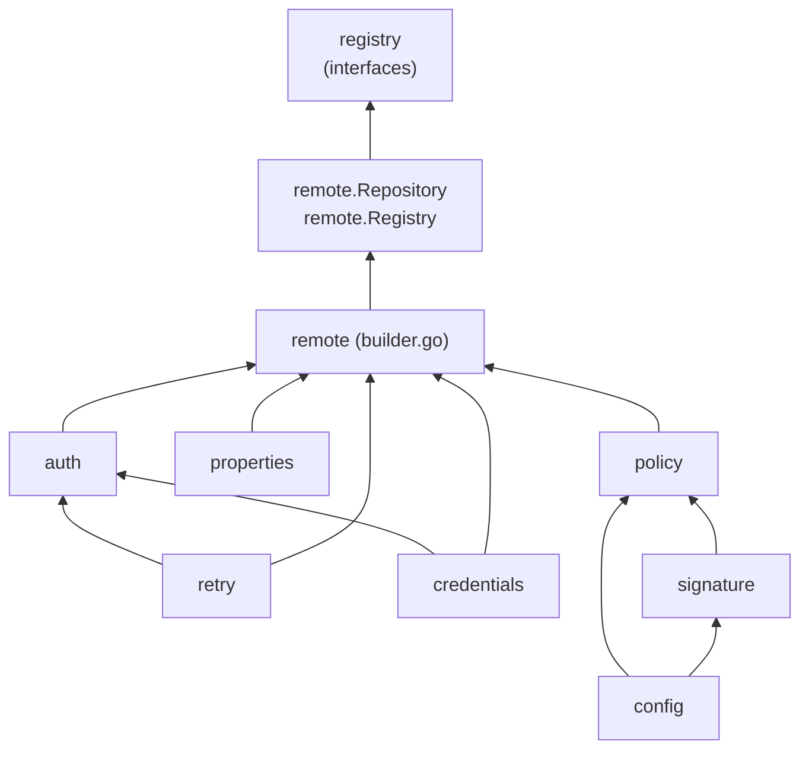

**Key principle:** dependencies flow upward. `credentials` and `retry` are foundational with no internal dependencies. `auth` depends on `credentials`. `properties` is standalone. `builder` composes them all. `config`, `policy`, and `signature` form the security layer above the transport.

---

## 9. Referrers API State Machine

The `remote.Repository` tracks whether the target registry supports the OCI Referrers API (introduced in Distribution Spec v1.1). This avoids re-probing on every call.

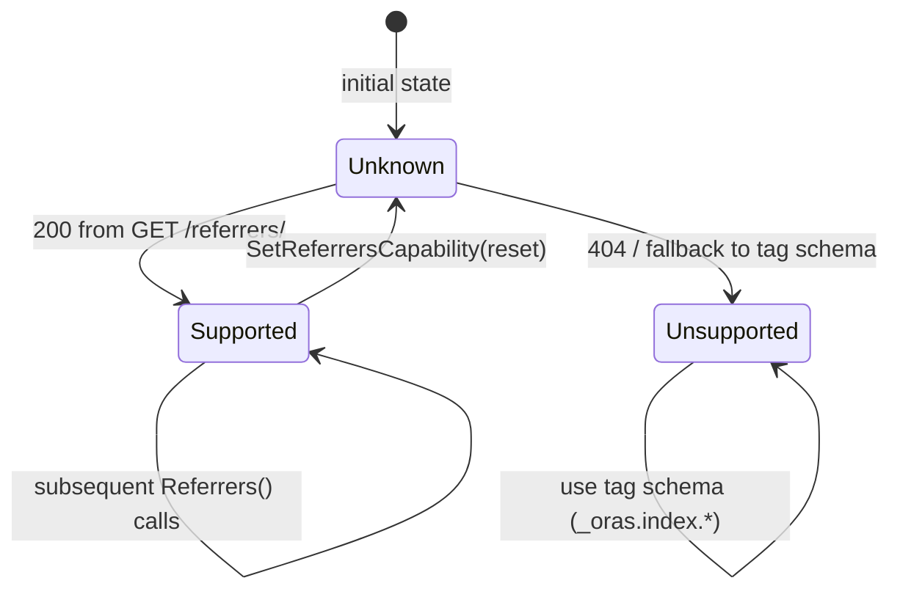

---

## 10. Breaking Changes from v2

| Area | v2 | v3 |
|---|---|---|
| `Credential` type location | `auth.Credential` | `credentials.Credential` (canonical) |
| `auth.Client.Credential` field | direct credential | `CredentialFunc credentials.CredentialFunc` |
| `ForceAttemptOAuth2` flag | `bool` field on `auth.Client` | removed; use `SetLegacyMode()` |
| Token fetching | embedded in `auth.Client` | extracted to `TokenFetcher` interface |
| Registry configuration | manual field-by-field setup | `properties.Registry` + `ClientBuilder` |
| Policy enforcement | not available | `policy` package + `WithPolicyEnforcement` middleware |
| Mirror support | not available | `properties.Mirror` + mirror fallback in `Repository` |
| Signature verification | not available | `signature` package + `LookasideStore` |
| Config loading | not available | `config.LoadConfigsWithOptions` |

---

## 11. Testing Strategy

### Unit Tests
- `TokenFetcher` implementations (`DistributionTokenFetcher`, `OAuth2TokenFetcher`) are testable in isolation via the `TokenFetcher` interface.
- `policyEnforcingRepository` is a pure wrapper — policy logic is testable without a live registry.
- `LookasideStore` supports `file://` URIs, enabling signature tests without an HTTP server.

### Functional Tests (`test/functional/`)
The functional test suite (`//go:build functional`) requires a live registry (default: `localhost:5000`):

| Test file | Coverage |
|---|---|
| `registry_test.go` | Ping, catalog, tag listing |
| `repository_test.go` | Push, pull, delete, resolve, referrers |
| `objects_functional_test.go` | `objects` package ORM API |
| `signature_test.go` | GPG sign/verify pipeline via `LookasideStore` |
| `config_test.go` | `LoadConfigsWithOptions` + full policy pipeline |

Run with:
```bash
cd test/functional
go test -tags functional -v ./...
```
